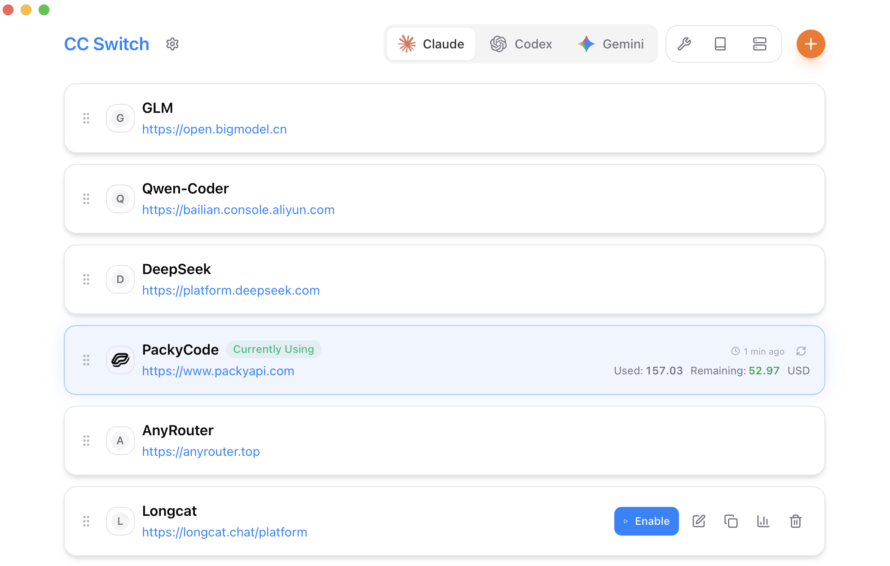

<div align="center">

# All-in-One Assistant for Claude Code, Codex & Gemini CLI

[](https://github.com/farion1231/cc-switch/releases)
[](https://github.com/farion1231/cc-switch/releases)
[](https://tauri.app/)
[](https://github.com/farion1231/cc-switch/releases/latest)

<a href="https://trendshift.io/repositories/15372" target="_blank"></a>

English | [中文](README_ZH.md) | [日本語](README_JA.md) | [Changelog](CHANGELOG.md)

</div>

## ❤️Sponsor

[](https://platform.minimax.io/subscribe/coding-plan?code=ClLhgxr2je&source=link)

MiniMax-M2.5 is a SOTA large language model designed for real-world productivity. Trained in a diverse range of complex real-world digital working environments, M2.5 builds upon the coding expertise of M2.1 to extend into general office work, reaching fluency in generating and operating Word, Excel, and Powerpoint files, context switching between diverse software environments, and working across different agent and human teams. Scoring 80.2% on SWE-Bench Verified, 51.3% on Multi-SWE-Bench, and 76.3% on BrowseComp, M2.5 is also more token efficient than previous generations, having been trained to optimize its actions and output through planning.

[Click](https://platform.minimax.io/subscribe/coding-plan?code=ClLhgxr2je&source=link) to get an exclusive 12% off the MiniMax Coding Plan!

---

<table>
<tr>
<td width="180"><a href="https://www.packyapi.com/register?aff=cc-switch"></a></td>
<td>Thanks to PackyCode for sponsoring this project! PackyCode is a reliable and efficient API relay service provider, offering relay services for Claude Code, Codex, Gemini, and more. PackyCode provides special discounts for our software users: register using <a href="https://www.packyapi.com/register?aff=cc-switch">this link</a> and enter the "cc-switch" promo code during first recharge to get 10% off.</td>
</tr>

<tr>
<td width="180"><a href="https://aigocode.com/invite/CC-SWITCH"></a></td>
<td>Thanks to AIGoCode for sponsoring this project! AIGoCode is an all-in-one platform that integrates Claude Code, Codex, and the latest Gemini models, providing you with stable, efficient, and highly cost-effective AI coding services. The platform offers flexible subscription plans, zero risk of account suspension, direct access with no VPN required, and lightning-fast responses. AIGoCode has prepared a special benefit for CC Switch users: if you register via <a href="https://aigocode.com/invite/CC-SWITCH">this link</a>, you'll receive an extra 10% bonus credit on your first top-up!</td>
</tr>

<tr>
<td width="180"><a href="https://www.aicodemirror.com/register?invitecode=9915W3"></a></td>
<td>Thanks to AICodeMirror for sponsoring this project! AICodeMirror provides official high-stability relay services for Claude Code / Codex / Gemini CLI, with enterprise-grade concurrency, fast invoicing, and 24/7 dedicated technical support.
Claude Code / Codex / Gemini official channels at 38% / 2% / 9% of original price, with extra discounts on top-ups! AICodeMirror offers special benefits for CC Switch users: register via <a href="https://www.aicodemirror.com/register?invitecode=9915W3">this link</a> to enjoy 20% off your first top-up, and enterprise customers can get up to 25% off!</td>
</tr>

<tr>
<td width="180"><a href="https://cubence.com/signup?code=CCSWITCH&source=ccs"></a></td>
<td>Thanks to Cubence for sponsoring this project! Cubence is a reliable and efficient API relay service provider, offering relay services for Claude Code, Codex, Gemini, and more with flexible billing options including pay-as-you-go and monthly plans. Cubence provides special discounts for CC Switch users: register using <a href="https://cubence.com/signup?code=CCSWITCH&source=ccs">this link</a> and enter the "CCSWITCH" promo code during recharge to get 10% off every top-up!</td>
</tr>

<tr>
<td width="180"><a href="https://www.dmxapi.cn/register?aff=bUHu"></a></td>
<td>Thanks to DMXAPI for sponsoring this project! DMXAPI provides global large model API services to 200+ enterprise users. One API key for all global models. Features include: instant invoicing, unlimited concurrency, starting from $0.15, 24/7 technical support. GPT/Claude/Gemini all at 32% off, domestic models 20-50% off, Claude Code exclusive models at 66% off! <a href="https://www.dmxapi.cn/register?aff=bUHu">Register here</a></td>
</tr>

<tr>
<td width="180"><a href="https://www.right.codes/register?aff=CCSWITCH"></a></td>
<td>Thank you to Right Code for sponsoring this project! Right Code reliably provides routing services for models such as Claude Code, Codex, and Gemini. It features a highly cost-effective Codex monthly subscription plan and <strong>supports quota rollovers—unused quota from one day can be carried over and used the next day.</strong> Invoices are available upon top-up. Enterprise and team users can receive dedicated one-on-one support. Right Code also offers an exclusive discount for CC Switch users: register via <a href="https://www.right.codes/register?aff=CCSWITCH">this link</a>, and with every top-up you will receive pay-as-you-go credit equivalent to 25% of the amount paid.</td>
</tr>

<tr>
<td width="180"><a href="https://aicoding.sh/i/CCSWITCH"></a></td>
<td>Thanks to AICoding.sh for sponsoring this project! AICoding.sh — Global AI Model API Relay Service at Unbeatable Prices! Claude Code at 19% of original price, GPT at just 1%! Trusted by hundreds of enterprises for cost-effective AI services. Supports Claude Code, GPT, Gemini and major domestic models, with enterprise-grade high concurrency, fast invoicing, and 24/7 dedicated technical support. CC Switch users who register via <a href="https://aicoding.sh/i/CCSWITCH">this link</a> get 10% off their first top-up!</td>
</tr>

<tr>
<td width="180"><a href="https://crazyrouter.com/register?aff=OZcm&ref=cc-switch"></a></td>
<td>Thanks to Crazyrouter for sponsoring this project! Crazyrouter is a high-performance AI API aggregation platform — one API key for 300+ models including Claude Code, Codex, Gemini CLI, and more. All models at 55% of official pricing with auto-failover, smart routing, and unlimited concurrency. Crazyrouter offers an exclusive deal for CC Switch users: register via <a href="https://crazyrouter.com/register?aff=OZcm&ref=cc-switch">this link</a>  to get <strong>$2 free credit</strong> instantly, plus enter promo code `CCSWITCH` on your first top-up for an extra <strong>30% bonus credit</strong>! </td>
</tr>

<tr>
<td width="180"><a href="https://www.sssaicode.com/register?ref=DCP0SM"></a></td>
<td>Thanks to SSSAiCode for sponsoring this project! SSSAiCode is a stable and reliable API relay service, dedicated to providing stable, reliable, and affordable Claude and Codex model services, <strong>offering high cost-effective official Claude service at just ¥0.5/$ equivalent</strong>, supporting monthly and pay-as-you-go billing plans with same-day fast invoicing. SSSAiCode offers a special deal for CC Switch users: register via <a href="https://www.sssaicode.com/register?ref=DCP0SM">this link</a> to enjoy $10 extra credit on every top-up!</td>
</tr>

</table>

## Screenshots

|                  Main Interface                   |                  Add Provider                  |
| :-----------------------------------------------: | :--------------------------------------------: |
|  |  |

## Features

### Current Version: v3.10.2 | [Full Changelog](CHANGELOG.md) | [Release Notes](docs/release-note-v3.9.0-en.md)

**v3.8.0 Major Update (2025-11-28)**

**Persistence Architecture Upgrade & Brand New UI**

- **SQLite + JSON Dual-layer Architecture**
  - Migrated from JSON file storage to SQLite + JSON dual-layer structure
  - Syncable data (providers, MCP, Prompts, Skills) stored in SQLite
  - Device-level data (window state, local paths) stored in JSON
  - Lays the foundation for future cloud sync functionality
  - Schema version management for database migrations

- **Brand New User Interface**
  - Completely redesigned interface layout
  - Unified component styles and smoother animations
  - Optimized visual hierarchy
  - Tailwind CSS downgraded from v4 to v3.4 for better browser compatibility

- **Japanese Language Support**
  - Added Japanese interface support (now supports Chinese/English/Japanese)

- **Auto Launch on Startup**
  - One-click enable/disable in settings
  - Platform-native APIs (Registry/LaunchAgent/XDG autostart)

- **Skills Recursive Scanning**
  - Support for multi-level directory structures
  - Allow same-named skills from different repositories

- **Critical Bug Fixes**
  - Fixed custom endpoints lost when updating providers
  - Fixed Gemini configuration write issues
  - Fixed Linux WebKitGTK rendering issues

**v3.7.0 Highlights**

**Six Core Features, 18,000+ Lines of New Code**

- **Gemini CLI Integration**
  - Third supported AI CLI (Claude Code / Codex / Gemini)
  - Dual-file configuration support (`.env` + `settings.json`)
  - Complete MCP server management
  - Presets: Google Official (OAuth) / PackyCode / Custom

- **Claude Skills Management System**
  - Auto-scan skills from GitHub repositories (3 pre-configured curated repos)
  - One-click install/uninstall to `~/.claude/skills/`
  - Custom repository support + subdirectory scanning
  - Complete lifecycle management (discover/install/update)

- **Prompts Management System**
  - Multi-preset system prompt management (unlimited presets, quick switching)
  - Cross-app support (Claude: `CLAUDE.md` / Codex: `AGENTS.md` / Gemini: `GEMINI.md`)
  - Markdown editor (CodeMirror 6 + real-time preview)
  - Smart backfill protection, preserves manual modifications

- **MCP v3.7.0 Unified Architecture**
  - Single panel manages MCP servers across three applications
  - New SSE (Server-Sent Events) transport type
  - Smart JSON parser + Codex TOML format auto-correction
  - Unified import/export + bidirectional sync

- **Deep Link Protocol**
  - `ccswitch://` protocol registration (all platforms)
  - One-click import provider configs via shared links
  - Security validation + lifecycle integration

- **Environment Variable Conflict Detection**
  - Auto-detect cross-app configuration conflicts (Claude/Codex/Gemini/MCP)
  - Visual conflict indicators + resolution suggestions
  - Override warnings + backup before changes

**Core Capabilities**

- **Provider Management**: One-click switching between Claude Code, Codex, and Gemini API configurations
- **AWS Bedrock Support**: Built-in AWS Bedrock provider presets with AKSK and API Key authentication, cross-region inference support (global/us/eu/apac), covering Claude Code and OpenCode
- **Speed Testing**: Measure API endpoint latency with visual quality indicators
- **Import/Export**: Backup and restore configs with auto-rotation (keep 10 most recent)
- **i18n Support**: Complete Chinese/English localization (UI, errors, tray)
- **Claude Plugin Sync**: One-click apply/restore Claude plugin configurations

**v3.6 Highlights**

- Provider duplication & drag-and-drop sorting
- Multi-endpoint management & custom config directory (cloud sync ready)
- Granular model configuration (4-tier: Haiku/Sonnet/Opus/Custom)
- WSL environment support with auto-sync on directory change
- 100% hooks test coverage & complete architecture refactoring

**System Features**

- System tray with quick switching
- Single instance daemon
- Built-in auto-updater
- Atomic writes with rollback protection

## Download & Installation

### System Requirements

- **Windows**: Windows 10 and above
- **macOS**: macOS 10.15 (Catalina) and above
- **Linux**: Ubuntu 22.04+ / Debian 11+ / Fedora 34+ and other mainstream distributions

### Windows Users

Download the latest `CC-Switch-v{version}-Windows.msi` installer or `CC-Switch-v{version}-Windows-Portable.zip` portable version from the [Releases](../../releases) page.

### macOS Users

**Method 1: Install via Homebrew (Recommended)**

```bash
brew tap farion1231/ccswitch
brew install --cask cc-switch
```

Update:

```bash
brew upgrade --cask cc-switch
```

**Method 2: Manual Download**

Download `CC-Switch-v{version}-macOS.zip` from the [Releases](../../releases) page and extract to use.

> **Note**: Since the author doesn't have an Apple Developer account, you may see an "unidentified developer" warning on first launch. Please close it first, then go to "System Settings" → "Privacy & Security" → click "Open Anyway", and you'll be able to open it normally afterwards.

### Arch Linux Users

**Install via paru (Recommended)**

```bash
paru -S cc-switch-bin
```

### Linux Users

Download the latest Linux build from the [Releases](../../releases) page:

- `CC-Switch-v{version}-Linux.deb` (Debian/Ubuntu)
- `CC-Switch-v{version}-Linux.rpm` (Fedora/RHEL/openSUSE)
- `CC-Switch-v{version}-Linux.AppImage` (Universal)
- `CC-Switch-v{version}-Linux.flatpak` (Flatpak)

Flatpak install & run:

```bash
flatpak install --user ./CC-Switch-v{version}-Linux.flatpak
flatpak run com.ccswitch.desktop
```

## Quick Start

### Basic Usage

1. **Add Provider**: Click "Add Provider" → Choose preset or create custom configuration
2. **Switch Provider**:
   - Main UI: Select provider → Click "Enable"
   - System Tray: Click provider name directly (instant effect)
3. **Takes Effect**: Restart your terminal or Claude Code / Codex / Gemini clients to apply changes
4. **Back to Official**: Select the "Official Login" preset (Claude/Codex) or "Google Official" preset (Gemini), restart the corresponding client, then follow its login/OAuth flow

### MCP Management

- **Location**: Click "MCP" button in top-right corner
- **Add Server**:
  - Use built-in templates (mcp-fetch, mcp-filesystem, etc.)
  - Support stdio / http / sse transport types
  - Configure independent MCP servers for different apps
- **Enable/Disable**: Toggle switches to control which servers sync to live config
- **Sync**: Enabled servers auto-sync to each app's live files
- **Import/Export**: Import existing MCP servers from Claude/Codex/Gemini config files

### Skills Management (v3.7.0 New)

- **Location**: Click "Skills" button in top-right corner
- **Discover Skills**:
  - Auto-scan pre-configured GitHub repositories (Anthropic official, ComposioHQ, community, etc.)
  - Add custom repositories (supports subdirectory scanning)
- **Install Skills**: Click "Install" to one-click install to `~/.claude/skills/`
- **Uninstall Skills**: Click "Uninstall" to safely remove and clean up state
- **Manage Repositories**: Add/remove custom GitHub repositories

### Prompts Management (v3.7.0 New)

- **Location**: Click "Prompts" button in top-right corner
- **Create Presets**:
  - Create unlimited system prompt presets
  - Use Markdown editor to write prompts (syntax highlighting + real-time preview)
- **Switch Presets**: Select preset → Click "Activate" to apply immediately
- **Sync Mechanism**:
  - Claude: `~/.claude/CLAUDE.md`
  - Codex: `~/.codex/AGENTS.md`
  - Gemini: `~/.gemini/GEMINI.md`
- **Protection Mechanism**: Auto-save current prompt content before switching, preserves manual modifications

### Configuration Files

**Claude Code**

- Live config: `~/.claude/settings.json` (or `claude.json`)
- API key field: `env.ANTHROPIC_AUTH_TOKEN` or `env.ANTHROPIC_API_KEY`
- MCP servers: `~/.claude.json` → `mcpServers`

**Codex**

- Live config: `~/.codex/auth.json` (required) + `config.toml` (optional)
- API key field: `OPENAI_API_KEY` in `auth.json`
- MCP servers: `~/.codex/config.toml` → `[mcp_servers]` tables

**Gemini**

- Live config: `~/.gemini/.env` (API key) + `~/.gemini/settings.json` (auth mode)
- API key field: `GEMINI_API_KEY` or `GOOGLE_GEMINI_API_KEY` in `.env`
- Environment variables: Support `GOOGLE_GEMINI_BASE_URL`, `GEMINI_MODEL`, etc.
- MCP servers: `~/.gemini/settings.json` → `mcpServers`
- Tray quick switch: Each provider switch rewrites `~/.gemini/.env`, no need to restart Gemini CLI

**CC Switch Storage (v3.8.0 New Architecture)**

- Database (SSOT): `~/.cc-switch/cc-switch.db` (SQLite, stores providers, MCP, Prompts, Skills)
- Local settings: `~/.cc-switch/settings.json` (device-level settings)
- Backups: `~/.cc-switch/backups/` (auto-rotate, keep 10)

### Cloud Sync Setup

1. Go to Settings → "Custom Configuration Directory"
2. Choose your cloud sync folder (Dropbox, OneDrive, iCloud, etc.)
3. Restart app to apply
4. Repeat on other devices to enable cross-device sync

> **Note**: First launch auto-imports existing Claude/Codex configs as default provider.

## Architecture Overview

### Design Principles

```
┌─────────────────────────────────────────────────────────────┐
│                    Frontend (React + TS)                    │
│  ┌─────────────┐  ┌──────────────┐  ┌──────────────────┐    │
│  │ Components  │  │    Hooks     │  │  TanStack Query  │    │
│  │   (UI)      │──│ (Bus. Logic) │──│   (Cache/Sync)   │    │
│  └─────────────┘  └──────────────┘  └──────────────────┘    │
└────────────────────────┬────────────────────────────────────┘
                         │ Tauri IPC
┌────────────────────────▼────────────────────────────────────┐
│                  Backend (Tauri + Rust)                     │
│  ┌─────────────┐  ┌──────────────┐  ┌──────────────────┐    │
│  │  Commands   │  │   Services   │  │  Models/Config   │    │
│  │ (API Layer) │──│ (Bus. Layer) │──│     (Data)       │    │
│  └─────────────┘  └──────────────┘  └──────────────────┘    │
└─────────────────────────────────────────────────────────────┘
```

**Core Design Patterns**

- **SSOT** (Single Source of Truth): All data stored in `~/.cc-switch/cc-switch.db` (SQLite)
- **Dual-layer Storage**: SQLite for syncable data, JSON for device-level settings
- **Dual-way Sync**: Write to live files on switch, backfill from live when editing active provider
- **Atomic Writes**: Temp file + rename pattern prevents config corruption
- **Concurrency Safe**: Mutex-protected database connection avoids race conditions
- **Layered Architecture**: Clear separation (Commands → Services → DAO → Database)

**Key Components**

- **ProviderService**: Provider CRUD, switching, backfill, sorting
- **McpService**: MCP server management, import/export, live file sync
- **ConfigService**: Config import/export, backup rotation
- **SpeedtestService**: API endpoint latency measurement

**v3.6 Refactoring**

- Backend: 5-phase refactoring (error handling → command split → tests → services → concurrency)
- Frontend: 4-stage refactoring (test infra → hooks → components → cleanup)
- Testing: 100% hooks coverage + integration tests (vitest + MSW)

## Development

### Environment Requirements

- Node.js 18+
- pnpm 8+
- Rust 1.85+
- Tauri CLI 2.8+

### Development Commands

```bash
# Install dependencies
pnpm install

# Dev mode (hot reload)
pnpm dev

# Type check
pnpm typecheck

# Format code
pnpm format

# Check code format
pnpm format:check

# Run frontend unit tests
pnpm test:unit

# Run tests in watch mode (recommended for development)
pnpm test:unit:watch

# Build application
pnpm build

# Build debug version
pnpm tauri build --debug
```

### Rust Backend Development

```bash
cd src-tauri

# Format Rust code
cargo fmt

# Run clippy checks
cargo clippy

# Run backend tests
cargo test

# Run specific tests
cargo test test_name

# Run tests with test-hooks feature
cargo test --features test-hooks
```

### Testing Guide (v3.6 New)

**Frontend Testing**:

- Uses **vitest** as test framework
- Uses **MSW (Mock Service Worker)** to mock Tauri API calls
- Uses **@testing-library/react** for component testing

**Test Coverage**:

- Hooks unit tests (100% coverage)
  - `useProviderActions` - Provider operations
  - `useMcpActions` - MCP management
  - `useSettings` series - Settings management
  - `useImportExport` - Import/export
- Integration tests
  - App main application flow
  - SettingsDialog complete interaction
  - MCP panel functionality

**Running Tests**:

```bash
# Run all tests
pnpm test:unit

# Watch mode (auto re-run)
pnpm test:unit:watch

# With coverage report
pnpm test:unit --coverage
```

## Tech Stack

**Frontend**: React 18 · TypeScript · Vite · TailwindCSS 4 · TanStack Query v5 · react-i18next · react-hook-form · zod · shadcn/ui · @dnd-kit

**Backend**: Tauri 2.8 · Rust · serde · tokio · thiserror · tauri-plugin-updater/process/dialog/store/log

**Testing**: vitest · MSW · @testing-library/react

## Project Structure

```
├── src/                      # Frontend (React + TypeScript)
│   ├── components/           # UI components (providers/settings/mcp/ui)
│   ├── hooks/                # Custom hooks (business logic)
│   ├── lib/
│   │   ├── api/              # Tauri API wrapper (type-safe)
│   │   └── query/            # TanStack Query config
│   ├── i18n/locales/         # Translations (zh/en)
│   ├── config/               # Presets (providers/mcp)
│   └── types/                # TypeScript definitions
├── src-tauri/                # Backend (Rust)
│   └── src/
│       ├── commands/         # Tauri command layer (by domain)
│       ├── services/         # Business logic layer
│       ├── app_config.rs     # Config data models
│       ├── provider.rs       # Provider domain models
│       ├── mcp.rs            # MCP sync & validation
│       └── lib.rs            # App entry & tray menu
├── tests/                    # Frontend tests
│   ├── hooks/                # Unit tests
│   └── components/           # Integration tests
└── assets/                   # Screenshots & partner resources
```

## Changelog

See [CHANGELOG.md](CHANGELOG.md) for version update details.

## Legacy Electron Version

[Releases](../../releases) retains v2.0.3 legacy Electron version

If you need legacy Electron code, you can pull the electron-legacy branch

## Contributing

Issues and suggestions are welcome!

Before submitting PRs, please ensure:

- Pass type check: `pnpm typecheck`
- Pass format check: `pnpm format:check`
- Pass unit tests: `pnpm test:unit`
- 💡 For new features, please open an issue for discussion before submitting a PR

## Star History

[](https://www.star-history.com/#farion1231/cc-switch&Date)

## License

MIT © Jason Young
