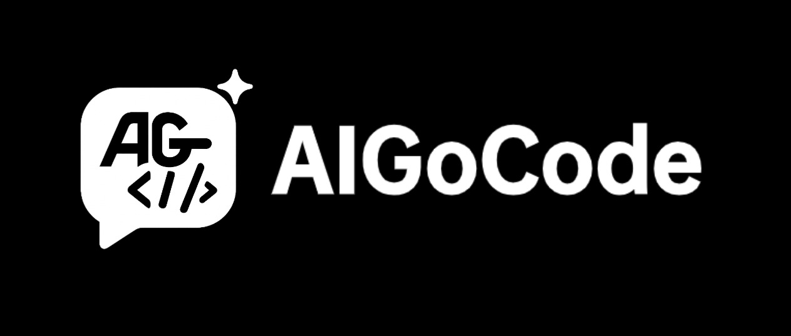
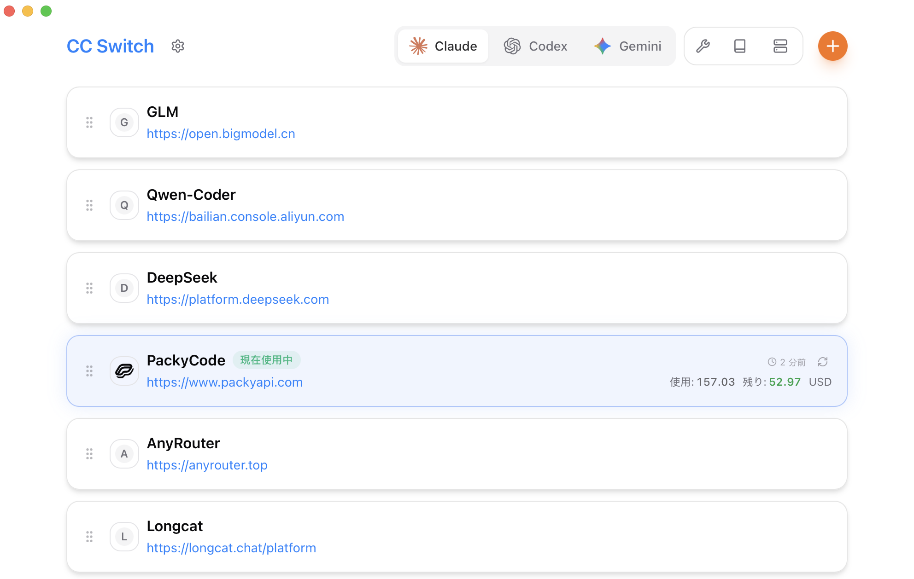

<div align="center">

# Claude Code / Codex / Gemini CLI オールインワン・アシスタント

[](https://github.com/farion1231/cc-switch/releases)
[](https://github.com/farion1231/cc-switch/releases)
[](https://tauri.app/)
[](https://github.com/farion1231/cc-switch/releases/latest)

<a href="https://trendshift.io/repositories/15372" target="_blank"></a>

[English](README.md) | [中文](README_ZH.md) | 日本語 | [Changelog](CHANGELOG.md) | [v3.9.0 リリースノート](docs/release-note-v3.9.0-ja.md)

</div>

## ❤️スポンサー

[](https://z.ai/subscribe?ic=8JVLJQFSKB)

本プロジェクトは Z.ai の GLM CODING PLAN による支援を受けています。GLM CODING PLAN は AI コーディング向けのサブスクリプションで、月額わずか 3 ドルから。Claude Code、Cline、Roo Code など 10 以上の人気 AI コーディングツールでフラッグシップモデル GLM-4.6 を利用でき、速く安定した開発体験を提供します。[このリンク](https://z.ai/subscribe?ic=8JVLJQFSKB) から申し込むと 10% オフになります！

---

<table>
<tr>
<td width="180"><a href="https://www.packyapi.com/register?aff=cc-switch"></a></td>
<td>PackyCode のご支援に感謝します！PackyCode は Claude Code、Codex、Gemini などのリレーサービスを提供する信頼性の高い API 中継プラットフォームです。本ソフト利用者向けに特別割引があります：<a href="https://www.packyapi.com/register?aff=cc-switch">このリンク</a>で登録し、チャージ時に「cc-switch」クーポンを入力すると 10% オフになります。</td>
</tr>

<tr>
<td width="180"><a href="https://aigocode.com/invite/CC-SWITCH"></a></td>
<td>本プロジェクトは AIGoCode のスポンサー提供でお届けしています。AIGoCode は、Claude Code・Codex・最新の Gemini モデルを統合したオールインワンのAIコーディングプラットフォームで、安定性・高速性・コストパフォーマンスに優れた開発サービスを提供します。柔軟なサブスクリプションプランを備え、レスポンスも非常に高速です。さらに、CC Switch ユーザー向けの特典として、<a href="https://aigocode.com/invite/CC-SWITCH">このリンク</a>から登録すると、初回チャージ時に10％分のボーナスクレジットが付与されます！</td>
</tr>

<tr>
<td width="180"><a href="https://www.dmxapi.cn/register?aff=bUHu"></a></td>
<td>DMXAPI のご支援に感謝します！DMXAPI は 200 社以上の企業ユーザーにグローバル大規模モデル API サービスを提供しています。1 つの API キーで全世界のモデルにアクセス可能。即時請求書発行、同時接続数無制限、最低 $0.15 から、24 時間年中無休のテクニカルサポート。GPT/Claude/Gemini が全て 32% オフ、国内モデルは 20〜50% オフ、Claude Code 専用モデルは 66% オフ実施中！<a href="https://www.dmxapi.cn/register?aff=bUHu">登録はこちら</a></td>
</tr>

<tr>
<td width="180"><a href="https://cubence.com/signup?code=CCSWITCH&source=ccs"></a></td>
<td>Cubence のご支援に感謝します！Cubence は Claude Code、Codex、Gemini などのリレーサービスを提供する信頼性の高い API 中継プラットフォームで、従量課金や月額プランなど柔軟な料金体系を提供しています。CC Switch ユーザー向けの特別割引：<a href="https://cubence.com/signup?code=CCSWITCH&source=ccs">このリンク</a>で登録し、チャージ時に「CCSWITCH」クーポンを入力すると、毎回 10% オフになります！</td>
</tr>

</table>

## スクリーンショット

|                  メイン画面                   |                  プロバイダ追加                  |
| :-------------------------------------------: | :----------------------------------------------: |
|  |  |

## 特長

### 現在のバージョン：v3.9.1 | [完全な更新履歴](CHANGELOG.md) | [リリースノート](docs/release-note-v3.9.0-ja.md)

**v3.8.0 メジャーアップデート (2025-11-28)**

**永続化アーキテクチャ刷新 & 新 UI**

- **SQLite + JSON 二層構造**
  - JSON 単独保存から SQLite + JSON の二層構造へ移行
  - 同期対象データ（プロバイダ、MCP、Prompts、Skills）は SQLite に保存
  - デバイス固有データ（ウィンドウ状態、ローカルパス）は JSON に保存
  - 将来のクラウド同期の土台を用意
  - DB マイグレーション用にスキーマバージョンを管理

- **新しいユーザーインターフェース**
  - レイアウトを全面再設計
  - コンポーネントスタイルとアニメーションを統一
  - 視覚的な階層を最適化
  - ブラウザ互換性向上のため Tailwind CSS を v4 から v3.4 にダウングレード

- **日本語対応**
  - UI が中国語/英語/日本語の 3 言語対応に

- **自動起動**
  - 設定画面でワンクリック ON/OFF
  - プラットフォームネイティブ API（Registry/LaunchAgent/XDG autostart）を使用

- **Skills 再帰スキャン**
  - 多階層ディレクトリをサポート
  - リポジトリが異なる同名スキルを許可

- **重要なバグ修正**
  - プロバイダ更新時にカスタムエンドポイントが失われる問題を修正
  - Gemini 設定の書き込み問題を修正
  - Linux WebKitGTK の描画問題を修正

**v3.7.0 ハイライト**

**6 つのコア機能、18,000 行超の新コード**

- **Gemini CLI 統合**
  - Claude Code / Codex / Gemini の 3 番目のサポート AI CLI
  - 2 つの設定ファイル（`.env` + `settings.json`）に対応
  - MCP サーバー管理を完備
  - プリセット：Google 公式（OAuth）/ PackyCode / カスタム

- **Claude Skills 管理システム**
  - GitHub リポジトリを自動スキャン（3 つのキュレーション済みリポジトリを同梱）
  - `~/.claude/skills/` へワンクリックでインストール/アンインストール
  - カスタムリポジトリ + サブディレクトリスキャンをサポート
  - ライフサイクル管理（検出/インストール/更新）を完備

- **Prompts 管理システム**
  - 無制限のシステムプロンプトプリセットを作成
  - Markdown エディタ（CodeMirror 6 + リアルタイムプレビュー）付き
  - スマートなバックフィル保護で手動変更を保持
  - 複数アプリに同時対応（Claude: `CLAUDE.md` / Codex: `AGENTS.md` / Gemini: `GEMINI.md`）

- **MCP v3.7.0 統合アーキテクチャ**
  - 1 つのパネルで 3 アプリの MCP を管理
  - 新たに SSE（Server-Sent Events）トランスポートを追加
  - スマート JSON パーサー + Codex TOML 自動修正
  - 双方向のインポート/エクスポート + 双方向同期

- **ディープリンクプロトコル**
  - `ccswitch://` を全プラットフォームで登録
  - 共有リンクからプロバイダ設定をワンクリックでインポート
  - セキュリティ検証 + ライフサイクル統合

- **環境変数の競合検知**
  - Claude/Codex/Gemini/MCP 間の設定競合を自動検出
  - 競合表示 + 解決ガイド
  - 上書き前の警告 + バックアップ

**コア機能**

- **プロバイダ管理**：Claude Code、Codex、Gemini の API 設定をワンクリックで切り替え
- **速度テスト**：エンドポイント遅延を計測し、品質を可視化
- **インポート/エクスポート**：設定をバックアップ・復元（最新 10 件を自動ローテーション）
- **多言語対応**：UI/エラー/トレイを含む中国語・英語・日本語ローカライズ
- **Claude プラグイン同期**：Claude プラグイン設定をワンクリックで適用/復元

**v3.6 ハイライト**

- プロバイダの複製とドラッグ＆ドロップ並び替え
- 複数エンドポイント管理とカスタム設定ディレクトリ（クラウド同期準備済み）
- 4 階層のモデル設定（Haiku/Sonnet/Opus/Custom）
- WSL 環境をサポートし、ディレクトリ変更時に自動同期
- Hooks テスト 100% カバレッジ + アーキテクチャ全面リファクタ

**システム機能**

- クイックスイッチ付きシステムトレイ
- シングルインスタンス常駐
- ビルトイン自動アップデータ
- ロールバック保護付きのアトミック書き込み

## ダウンロード & インストール

### システム要件

- **Windows**: Windows 10 以上
- **macOS**: macOS 10.15 (Catalina) 以上
- **Linux**: Ubuntu 22.04+ / Debian 11+ / Fedora 34+ など主要ディストリビューション

### Windows ユーザー

[Releases](../../releases) ページから最新版の `CC-Switch-v{version}-Windows.msi` インストーラー、またはポータブル版 `CC-Switch-v{version}-Windows-Portable.zip` をダウンロード。

### macOS ユーザー

**方法 1: Homebrew でインストール（推奨）**

```bash
brew tap farion1231/ccswitch
brew install --cask cc-switch
```

アップデート:

```bash
brew upgrade --cask cc-switch
```

**方法 2: 手動ダウンロード**

[Releases](../../releases) から `CC-Switch-v{version}-macOS.zip` をダウンロードして展開。

> **注意**: 開発者アカウント未登録のため、初回起動時に「開発元を確認できません」と表示される場合があります。一度閉じてから「システム設定」→「プライバシーとセキュリティ」→「このまま開く」をクリックしてください。以降は通常通り起動できます。

### ArchLinux ユーザー

**paru でインストール（推奨）**

```bash
paru -S cc-switch-bin
```

### Linux ユーザー

[Releases](../../releases) から最新版の Linux ビルドをダウンロード：

- `CC-Switch-v{version}-Linux.deb`（Debian/Ubuntu）
- `CC-Switch-v{version}-Linux.rpm`（Fedora/RHEL/openSUSE）
- `CC-Switch-v{version}-Linux.AppImage`（汎用）
- `CC-Switch-v{version}-Linux.flatpak`（Flatpak）

Flatpak のインストールと起動：

```bash
flatpak install --user ./CC-Switch-v{version}-Linux.flatpak
flatpak run com.ccswitch.desktop
```

## クイックスタート

### 基本的な使い方

1. **プロバイダ追加**：「Add Provider」をクリック → プリセットを選ぶかカスタム設定を作成
2. **プロバイダ切り替え**:
   - メイン UI: プロバイダを選択 → 「Enable」をクリック
   - システムトレイ: プロバイダ名をクリック（即時反映）
3. **反映**: ターミナルや Claude Code / Codex / Gemini クライアントを再起動して適用
4. **公式設定に戻す**: 「Official Login」プリセット（Claude/Codex）または「Google Official」プリセット（Gemini）を選び、対応クライアントを再起動してログイン/OAuth を実行

### MCP 管理

- **入口**: 右上の「MCP」ボタンをクリック
- **サーバー追加**:
  - 組み込みテンプレート（mcp-fetch、mcp-filesystem など）を使用
  - stdio / http / sse の各トランスポートをサポート
  - アプリごとに独立した MCP を設定可能
- **有効/無効**: トグルでライブ設定への同期を切り替え
- **同期**: 有効なサーバーは各アプリのライブファイルへ自動同期
- **インポート/エクスポート**: Claude/Codex/Gemini の設定ファイルから既存 MCP を取り込み

### Skills 管理 (v3.7.0 新機能)

- **入口**: 右上の「Skills」ボタンをクリック
- **スキル探索**:
  - 事前設定済みの GitHub リポジトリを自動スキャン（Anthropic 公式、ComposioHQ、コミュニティなど）
  - カスタムリポジトリを追加（サブディレクトリスキャン対応）
- **インストール**: 「Install」を押すだけで `~/.claude/skills/` に配置
- **アンインストール**: 「Uninstall」で安全に削除と状態クリーンアップ
- **リポジトリ管理**: カスタム GitHub リポジトリを追加/削除

### Prompts 管理 (v3.7.0 新機能)

- **入口**: 右上の「Prompts」ボタンをクリック
- **プリセット作成**:
  - 無制限のシステムプロンプトプリセットを作成
  - Markdown エディタで記述（シンタックスハイライト + リアルタイムプレビュー）
- **プリセット切り替え**: プリセットを選択 → 「Activate」で即適用
- **同期先**:
  - Claude: `~/.claude/CLAUDE.md`
  - Codex: `~/.codex/AGENTS.md`
  - Gemini: `~/.gemini/GEMINI.md`
- **保護機構**: 切り替え前に現在の内容を自動保存し、手動変更を保持

### 設定ファイルパス

**Claude Code**

- ライブ設定: `~/.claude/settings.json`（または `claude.json`）
- API キーフィールド: `env.ANTHROPIC_AUTH_TOKEN` または `env.ANTHROPIC_API_KEY`
- MCP サーバー: `~/.claude.json` → `mcpServers`

**Codex**

- ライブ設定: `~/.codex/auth.json`（必須）+ `config.toml`（任意）
- API キーフィールド: `auth.json` 内の `OPENAI_API_KEY`
- MCP サーバー: `~/.codex/config.toml` → `[mcp_servers]` テーブル

**Gemini**

- ライブ設定: `~/.gemini/.env`（API キー）+ `~/.gemini/settings.json`（認証モード）
- API キーフィールド: `.env` 内の `GEMINI_API_KEY` または `GOOGLE_GEMINI_API_KEY`
- 環境変数: `GOOGLE_GEMINI_BASE_URL`、`GEMINI_MODEL` などをサポート
- MCP サーバー: `~/.gemini/settings.json` → `mcpServers`
- トレイでのクイックスイッチ: プロバイダ切り替えごとに `~/.gemini/.env` を書き換えるため Gemini CLI の再起動は不要

**CC Switch 保存先 (v3.8.0 新アーキテクチャ)**

- データベース (SSOT): `~/.cc-switch/cc-switch.db`（SQLite。プロバイダ、MCP、Prompts、Skills を保存）
- ローカル設定: `~/.cc-switch/settings.json`（デバイスレベル設定）
- バックアップ: `~/.cc-switch/backups/`（自動ローテーション、最新 10 件を保持）

### クラウド同期の設定

1. 設定 → 「Custom Configuration Directory」へ進む
2. クラウド同期フォルダ（Dropbox、OneDrive、iCloud など）を選択
3. アプリを再起動して反映
4. 他のデバイスでも同じフォルダを指定すればクロスデバイス同期が有効に

> **補足**: 初回起動時に既存の Claude/Codex 設定をデフォルトプロバイダとして自動インポートします。

## アーキテクチャ概要

### 設計原則

```
┌─────────────────────────────────────────────────────────────┐
│                    Frontend (React + TS)                    │
│  ┌─────────────┐  ┌──────────────┐  ┌──────────────────┐    │
│  │ Components  │  │    Hooks     │  │  TanStack Query  │    │
│  │   (UI)      │──│ (Bus. Logic) │──│   (Cache/Sync)   │    │
│  └─────────────┘  └──────────────┘  └──────────────────┘    │
└────────────────────────┬────────────────────────────────────┘
                         │ Tauri IPC
┌────────────────────────▼────────────────────────────────────┐
│                  Backend (Tauri + Rust)                     │
│  ┌─────────────┐  ┌──────────────┐  ┌──────────────────┐    │
│  │  Commands   │  │   Services   │  │  Models/Config   │    │
│  │ (API Layer) │──│ (Bus. Layer) │──│     (Data)       │    │
│  └─────────────┘  └──────────────┘  └──────────────────┘    │
└─────────────────────────────────────────────────────────────┘
```

**コア設計パターン**

- **SSOT** (Single Source of Truth): すべてのデータを `~/.cc-switch/cc-switch.db`（SQLite）に集約
- **二層ストレージ**: 同期データは SQLite、デバイスデータは JSON
- **双方向同期**: 切り替え時はライブファイルへ書き込み、編集時はアクティブプロバイダから逆同期
- **アトミック書き込み**: 一時ファイル + rename パターンで設定破損を防止
- **並行安全**: Mutex で保護された DB 接続でレースを防ぐ
- **レイヤードアーキテクチャ**: Commands → Services → DAO → Database を明確に分離

**主要コンポーネント**

- **ProviderService**: プロバイダの CRUD、切り替え、バックフィル、ソート
- **McpService**: MCP サーバー管理、インポート/エクスポート、ライブファイル同期
- **ConfigService**: 設定のインポート/エクスポート、バックアップローテーション
- **SpeedtestService**: API エンドポイントの遅延計測

**v3.6 リファクタリング**

- バックエンド: エラーハンドリング → コマンド分割 → テスト → サービス層 → 並行性の 5 フェーズ
- フロントエンド: テスト基盤 → hooks → コンポーネント → クリーンアップの 4 ステージ
- テスト: hooks 100% カバレッジ + 統合テスト（vitest + MSW）

## 開発

### 開発環境

- Node.js 18+
- pnpm 8+
- Rust 1.85+
- Tauri CLI 2.8+

### 開発コマンド

```bash
# 依存関係をインストール
pnpm install

# ホットリロード付き開発モード
pnpm dev

# 型チェック
pnpm typecheck

# コード整形
pnpm format

# フォーマット検証
pnpm format:check

# フロントエンド単体テスト
pnpm test:unit

# ウォッチモード（開発に推奨）
pnpm test:unit:watch

# アプリをビルド
pnpm build

# デバッグビルド
pnpm tauri build --debug
```

### Rust バックエンド開発

```bash
cd src-tauri

# Rust コード整形
cargo fmt

# clippy チェック
cargo clippy

# バックエンドテスト
cargo test

# 特定テストのみ実行
cargo test test_name

# test-hooks フィーチャー付きでテスト
cargo test --features test-hooks
```

### テストガイド (v3.6)

**フロントエンドテスト**:

- テストフレームワークに **vitest** を使用
- **MSW (Mock Service Worker)** で Tauri API 呼び出しをモック
- コンポーネントテストに **@testing-library/react** を採用

**テストカバレッジ**:

- Hooks の単体テスト（100% カバレッジ）
  - `useProviderActions` - プロバイダ操作
  - `useMcpActions` - MCP 管理
  - `useSettings` 系 - 設定管理
  - `useImportExport` - インポート/エクスポート
- 統合テスト
  - アプリのメインフロー
  - SettingsDialog の一連操作
  - MCP パネルの機能

**テスト実行**:

```bash
# 全テストを実行
pnpm test:unit

# ウォッチモード（自動再実行）
pnpm test:unit:watch

# カバレッジレポート付き
pnpm test:unit --coverage
```

## 技術スタック

**フロントエンド**: React 18 · TypeScript · Vite · TailwindCSS 4 · TanStack Query v5 · react-i18next · react-hook-form · zod · shadcn/ui · @dnd-kit

**バックエンド**: Tauri 2.8 · Rust · serde · tokio · thiserror · tauri-plugin-updater/process/dialog/store/log

**テスト**: vitest · MSW · @testing-library/react

## プロジェクト構成

```
├── src/                      # フロントエンド (React + TypeScript)
│   ├── components/           # UI コンポーネント (providers/settings/mcp/ui)
│   ├── hooks/                # ビジネスロジック用カスタムフック
│   ├── lib/
│   │   ├── api/              # Tauri API ラッパー (型安全)
│   │   └── query/            # TanStack Query 設定
│   ├── i18n/locales/         # 翻訳 (zh/en)
│   ├── config/               # プリセット (providers/mcp)
│   └── types/                # TypeScript 型定義
├── src-tauri/                # バックエンド (Rust)
│   └── src/
│       ├── commands/         # Tauri コマンド層 (ドメイン別)
│       ├── services/         # ビジネスロジック層
│       ├── app_config.rs     # 設定モデル
│       ├── provider.rs       # プロバイダドメインモデル
│       ├── mcp.rs            # MCP 同期 & 検証
│       └── lib.rs            # アプリエントリ & トレイメニュー
├── tests/                    # フロントエンドテスト
│   ├── hooks/                # 単体テスト
│   └── components/           # 統合テスト
└── assets/                   # スクリーンショット & スポンサーリソース
```

## 更新履歴

詳細は [CHANGELOG.md](CHANGELOG.md) をご覧ください。

## 旧 Electron 版

[Releases](../../releases) に v2.0.3 の Electron 旧版を残しています。

旧版コードが必要な場合は `electron-legacy` ブランチを取得してください。

## 貢献

Issue や提案を歓迎します！

PR を送る前に以下をご確認ください:

- 型チェック: `pnpm typecheck`
- フォーマットチェック: `pnpm format:check`
- 単体テスト: `pnpm test:unit`
- 💡 新機能の場合は、事前に Issue でディスカッションしていただけると助かります

## Star History

[](https://www.star-history.com/#farion1231/cc-switch&Date)

## ライセンス

MIT © Jason Young
