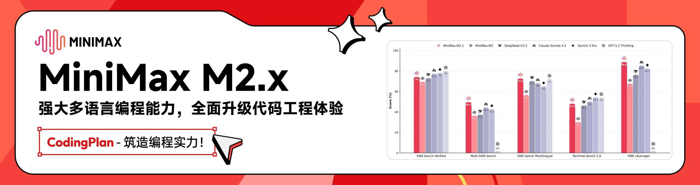
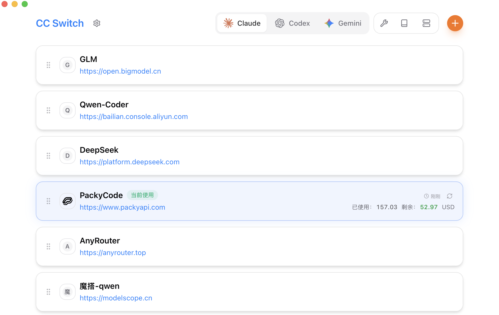

<div align="center">

# CC Switch

### Claude Code、Codex、Gemini CLI、OpenCode 和 OpenClaw 的全方位管理工具

[](https://github.com/farion1231/cc-switch/releases)
[](https://github.com/farion1231/cc-switch/releases)
[](https://tauri.app/)
[](https://github.com/farion1231/cc-switch/releases/latest)

<a href="https://trendshift.io/repositories/15372" target="_blank"></a>

[English](README.md) | 中文 | [日本語](README_JA.md) | [更新日志](CHANGELOG.md)

</div>

## ❤️赞助商

<details open>
<summary>点击折叠</summary>

[](https://platform.minimaxi.com/subscribe/coding-plan?code=7kYF2VoaCn&source=link)

MiniMax M2.5 在编程、工具调用与搜索、办公等核心生产力场景均达到或刷新行业 SOTA，拥有架构师级代码能力与高效任务拆解能力，推理速度较上一代提升 37%、token 消耗更优；100 token/s 连续工作一小时仅需 1 美金，让复杂 Agent 规模化部署经济可行，已在企业多职能场景深度落地，加速全民 Agent 时代到来。

[点击](https://platform.minimaxi.com/subscribe/coding-plan?code=7kYF2VoaCn&source=link)即可领取 MiniMax Coding Plan 专属 88 折优惠！

---

<table>
<tr>
<td width="180"><a href="https://www.packyapi.com/register?aff=cc-switch"></a></td>
<td>感谢 PackyCode 赞助了本项目！PackyCode 是一家稳定、高效的API中转服务商，提供 Claude Code、Codex、Gemini 等多种中转服务。PackyCode 为本软件的用户提供了特别优惠，使用<a href="https://www.packyapi.com/register?aff=cc-switch">此链接</a>注册并在充值时填写"cc-switch"优惠码，首次充值可以享受9折优惠！</td>
</tr>

<tr>
<td width="180"><a href="https://aigocode.com/invite/CC-SWITCH"></a></td>
<td>感谢 AIGoCode 赞助了本项目！AIGoCode 是一个集成了 Claude Code、Codex 以及 Gemini 最新模型的一站式平台，为你提供稳定、高效且高性价比的AI编程服务。本站提供灵活的订阅计划，零封号风险，国内直连，无需魔法，极速响应。AIGoCode 为 CC Switch 的用户提供了特别福利，通过<a href="https://aigocode.com/invite/CC-SWITCH">此链接</a>注册的用户首次充值可以获得额外10%奖励额度！</td>
</tr>

<tr>
<td width="180"><a href="https://www.aicodemirror.com/register?invitecode=9915W3"></a></td>
<td>感谢 AICodeMirror 赞助了本项目！AICodeMirror 提供 Claude Code / Codex / Gemini CLI 官方高稳定中转服务，支持企业级高并发、极速开票、7×24 专属技术支持。
Claude Code / Codex / Gemini 官方渠道低至 3.8 / 0.2 / 0.9 折，充值更有折上折！AICodeMirror 为 CCSwitch 的用户提供了特别福利，通过<a href="https://www.aicodemirror.com/register?invitecode=9915W3">此链接</a>注册的用户，可享受首充8折，企业客户最高可享 7.5 折！</td>
</tr>

<tr>
<td width="180"><a href="https://cubence.com/signup?code=CCSWITCH&source=ccs"></a></td>
<td>感谢 Cubence 赞助本项目！Cubence 是一家可靠高效的 API 中继服务提供商，提供对 Claude Code、Codex、Gemini 等模型的中继服务，并提供按量、包月等灵活的计费方式。Cubence 为 CC Switch 的用户提供了特别优惠：使用 <a href="https://cubence.com/signup?code=CCSWITCH&source=ccs">此链接</a> 注册，并在充值时输入 "CCSWITCH" 优惠码，每次充值均可享受九折优惠！</td>
</tr>

<tr>
<td width="180"><a href="https://www.dmxapi.cn/register?aff=bUHu"></a></td>
<td>感谢 DMXAPI（大模型API）赞助了本项目！ DMXAPI，一个Key用全球大模型。
为200多家企业用户提供全球大模型API服务。· 充值即开票 ·当天开票 ·并发不限制  ·1元起充 ·  7x24 在线技术辅导，GPT/Claude/Gemini全部6.8折，国内模型5~8折，Claude Code 专属模型3.4折进行中！<a href="https://www.dmxapi.cn/register?aff=bUHu">点击这里注册</a></td>
</tr>

<tr>
<td width="180"><a href="https://www.right.codes/register?aff=CCSWITCH"></a></td>
<td>感谢 Right Code 赞助了本项目！Right Code 稳定提供 Claude Code、Codex、Gemini 等模型的中转服务。主打<strong>极高性价比</strong>的Codex包月套餐，<strong>提供额度转结，套餐当天用不完的额度，第二天还能接着用！</strong>充值即可开票，企业、团队用户一对一对接。同时为 CC Switch 的用户提供了特别优惠：通过<a href="https://www.right.codes/register?aff=CCSWITCH">此链接</a>注册，每次充值均可获得实付金额25%的按量额度！</td>
</tr>

<tr>
<td width="180"><a href="https://aicoding.sh/i/CCSWITCH"></a></td>
<td>感谢 AICoding.sh 赞助了本项目！AICoding.sh —— 全球大模型 API 超值中转服务！Claude Code 1.9 折，GPT 0.1 折，已为数百家企业提供高性价比 AI 服务。支持 Claude Code、GPT、Gemini 及国内主流模型，企业级高并发、极速开票、7×24 专属技术支持，通过<a href="https://aicoding.sh/i/CCSWITCH">此链接</a> 注册的 CC Switch 用户，首充可享受九折优惠！</td>
</tr>

<tr>
<td width="180"><a href="https://crazyrouter.com/register?aff=OZcm&ref=cc-switch"></a></td>
<td>感谢 Crazyrouter 赞助了本项目！Crazyrouter 是一个高性能 AI API 聚合平台——一个 API Key 即可访问 300+ 模型，包括 Claude Code、Codex、Gemini CLI 等。全部模型低至官方定价的 55%，支持自动故障转移、智能路由和无限并发。Crazyrouter 为 CC Switch 用户提供了专属优惠：通过<a href="https://crazyrouter.com/register?aff=OZcm&ref=cc-switch">此链接</a>注册即可获得 <strong>$2 免费额度</strong>，首次充值时输入优惠码 `CCSWITCH` 还可获得额外 <strong>30% 奖励额度</strong>！</td>
</tr>

<tr>
<td width="180"><a href="https://www.sssaicode.com/register?ref=DCP0SM"></a></td>
<td>感谢 SSSAiCode 赞助了本项目！SSSAiCode 是一家稳定可靠的API中转站，致力于提供稳定、可靠、平价的Claude、CodeX模型服务，<strong>提供高性价比折合0.5￥/$的官方Claude服务</strong>，支持包月、Paygo多种计费方式、支持当日快速开票，SSSAiCode为本软件的用户提供特别优惠，使用<a href="https://www.sssaicode.com/register?ref=DCP0SM">此链接</a>注册每次充值均可享受10$的额外奖励！</td>
</tr>

</table>

</details>

## 为什么选择 CC Switch？

现代 AI 编程依赖于 Claude Code、Codex、Gemini CLI、OpenCode 和 OpenClaw 等 CLI 工具——但每个工具都有自己的配置格式。切换 API 供应商意味着手动编辑 JSON、TOML 或 `.env` 文件，而在多个工具之间缺乏一个统一管理 MCP, SKILLS 的方式。

**CC Switch** 为你提供一个桌面应用来管理所有五个 CLI 工具。无需手动编辑配置文件，你将获得一个可视化界面，一键将供应商导入应用，一键在不同的供应商之间进行切换，内置 50+ 供应商预设、统一的 MCP, SKILLS 管理以及系统托盘即时切换功能——所有操作都基于可靠的 SQLite 数据库和原子写入机制，保护你的配置不被损坏。

- **一个应用，五个 CLI 工具** — 在单一界面中管理 Claude Code、Codex、Gemini CLI、OpenCode 和 OpenClaw
- **告别手动编辑** — 50+ 供应商预设，包括 AWS Bedrock、NVIDIA NIM 和社区中转服务；一键即可切换
- **统一 MCP, SKILLS 管理** — 一个面板管理四个应用的 MCP, SKILLS, 支持双向同步
- **系统托盘快速切换** — 从托盘菜单即时切换供应商，无需打开完整应用
- **云同步** — 通过 Dropbox、OneDrive、iCloud 或 WebDAV 服务器在不同设备之间同步供应商数据
- **跨平台** — 基于 Tauri 2 构建的原生桌面应用，支持 Windows、macOS 和 Linux
- **小工具** - 内置了多种小工具来解决首次安装登录确认、禁止签名、插件拓展同步等多种功能

## 界面预览

|                  主界面                   |                  添加供应商                  |
| :---------------------------------------: | :------------------------------------------: |
|  |  |

## 功能特性

[完整更新日志](CHANGELOG.md) | [发布说明](docs/release-note-v3.11.1-zh.md)

### 供应商管理

- **5 个 CLI 工具，50+ 预设** — Claude Code、Codex、Gemini CLI、OpenCode、OpenClaw；复制 key 即可一键导入
- **通用供应商** — 一份配置同步到多个应用（OpenCode、OpenClaw）
- 一键切换、系统托盘快速访问、拖拽排序、导入导出

### 代理与故障转移

- **本地代理热切换** — 格式转换、自动故障转移、熔断器、供应商健康监控和整流器
- **应用级代理接管** — 独立为 Claude、Codex 或 Gemini 配置代理，具体到单个供应商

### MCP、Prompts 与 Skills

- **统一 MCP 面板** — 管理 4 个应用的 MCP 服务器，双向同步，支持 Deep Link 导入
- **Prompts** — Markdown 编辑器，跨应用同步（CLAUDE.md / AGENTS.md / GEMINI.md），回填保护
- **Skills** — 从 GitHub 仓库或 ZIP 文件一键安装，自定义仓库管理，支持软连接和文件复制

### 用量与成本追踪

- **用量仪表盘** — 跨供应商追踪支出、请求数和 Token 用量，趋势图表、详细请求日志和自定义模型定价

### 会话管理器与工作区

- 浏览、搜索和恢复全部应用对话历史
- **工作区编辑器**（OpenClaw）— 编辑 Agent 文件（AGENTS.md、SOUL.md 等），支持 Markdown 预览

### 系统与平台

- **云同步** — 自定义配置目录（Dropbox、OneDrive、iCloud、坚果云、NAS）及 WebDAV 服务器同步
- **Deep Link** (`ccswitch://`) — 通过 URL 一键导入供应商、MCP 服务器、提示词和技能
- 深色 / 浅色 / 跟随系统主题、开机自启、自动更新、原子写入、自动备份、国际化（中/英/日）

## 常见问题

<details>
<summary><strong>CC Switch 支持哪些 AI CLI 工具？</strong></summary>

CC Switch 支持五个工具：**Claude Code**、**Codex**、**Gemini CLI**、**OpenCode** 和 **OpenClaw**。每个工具都有专属的供应商预设和配置管理。

</details>

<details>
<summary><strong>切换供应商后需要重启终端吗？</strong></summary>

大多数工具需要重启终端或 CLI 工具才能使更改生效。例外的是 **Claude Code**，它目前支持供应商数据的热切换，无需重启。

</details>

<details>
<summary><strong>切换供应商之后我的插件配置怎么不见了？</strong></summary>

CC Switch 使用“通用配置片段”功能，在不同的供应商之间传递 Key 和请求地址之外的通用数据，您可以在“编辑供应商”菜单的“通用配置面板”里，点击“从当前供应商提取”，把所有的通用数据提取到通用配置中，之后在新建“供应商”的时候，只要勾选“写入通用配置”（默认勾选），就会把插件等数据写入到新的供应商配置中。您的所有配置项都会保存在运行本软件的时候，第一次导入的默认供应商里面，不会丢失。

</details>

<details>
<summary><strong>macOS 提示"未知开发者"警告 — 如何解决？</strong></summary>

这是由于作者没有苹果开发者账号（正在注册中）。关闭警告后，前往**系统设置 → 隐私与安全性 → 仍要打开**。之后应用即可正常打开。

</details>

<details>
<summary><strong>为什么总有一个正在激活中的供应商无法删除？</strong></summary>

本软件的设计原则是“最小侵入性”，即使卸载本软件，也不会影响应用的正常使用。

所以系统总会保留一个正在激活中的配置，因为如果将所有配置全部删除，该应用将无法正常使用。如果你不经常使用某个对应的应用，可以在设置中关掉该应用的显示。如果你想切换回官方登录，可以参考下条。

</details>

<details>
<summary><strong>如何切换回官方登录？</strong></summary>

可以在预设供应商里面添加一个官方供应商。切换过去之后，执行一遍 Log out / Log in 流程，之后便可以在官方供应商和第三方供应商之间随意切换。CodeX 可以在不同官方供应商之间进行切换，方便多个 Plus 或者 Team 账号之间切换。

</details>

<details>
<summary><strong>我的数据存储在哪里？</strong></summary>

- **数据库**：`~/.cc-switch/cc-switch.db`（SQLite — 供应商、MCP、提示词、技能）
- **本地设置**：`~/.cc-switch/settings.json`（设备级 UI 偏好设置）
- **备份**：`~/.cc-switch/backups/`（自动轮换，保留最近 10 个）
- **SKILLS**：`~/.cc-switch/skills/`（默认通过软链接连接到对应应用）

</details>

## 快速开始

### 基本使用

1. **添加供应商**：点击"添加供应商" → 选择预设或创建自定义配置
2. **切换供应商**：
   - 主界面：选择供应商 → 点击"启用"
   - 系统托盘：直接点击供应商名称（立即生效）
3. **生效方式**：重启终端或对应的 CLI 工具以应用更改（CLaude Code 无需重启）
4. **恢复官方登录**：添加"官方登录"预设，重启 CLI 工具后按照其登录/OAuth 流程操作

### MCP、Prompts、Skills 与会话

- **MCP**：点击"MCP"按钮 → 通过模板或自定义配置添加服务器 → 切换各应用同步开关
- **Prompts**：点击"Prompts" → 使用 Markdown 编辑器创建预设 → 激活后同步到 live 文件
- **Skills**：点击"Skills" → 浏览 GitHub 仓库 → 一键安装到全部应用
- **会话**：点击"Sessions" → 浏览和搜索和恢复全部应用对话历史

> **注意**：首次启动可以手动导入现有 CLI 工具配置作为默认供应商。

## 下载安装

### 系统要求

- **Windows**：Windows 10 及以上
- **macOS**：macOS 10.15 (Catalina) 及以上
- **Linux**：Ubuntu 22.04+ / Debian 11+ / Fedora 34+ 等主流发行版

### Windows 用户

从 [Releases](../../releases) 页面下载最新版本的 `CC-Switch-v{版本号}-Windows.msi` 安装包或 `CC-Switch-v{版本号}-Windows-Portable.zip` 绿色版。

### macOS 用户

**方式一：通过 Homebrew 安装（推荐）**

```bash
brew tap farion1231/ccswitch
brew install --cask cc-switch
```

更新：

```bash
brew upgrade --cask cc-switch
```

**方式二：手动下载**

从 [Releases](../../releases) 页面下载 `CC-Switch-v{版本号}-macOS.zip` 解压使用。

> **注意**：由于作者没有苹果开发者账号，首次打开可能出现"未知开发者"警告，请先关闭，然后前往"系统设置" → "隐私与安全性" → 点击"仍要打开"，之后便可以正常打开。

### Arch Linux 用户

**通过 paru 安装（推荐）**

```bash
paru -S cc-switch-bin
```

### Linux 用户

从 [Releases](../../releases) 页面下载最新版本的 Linux 安装包：

- `CC-Switch-v{版本号}-Linux.deb`（Debian/Ubuntu）
- `CC-Switch-v{版本号}-Linux.rpm`（Fedora/RHEL/openSUSE）
- `CC-Switch-v{版本号}-Linux.AppImage`（通用）
- `CC-Switch-v{版本号}-Linux.flatpak`（Flatpak）

Flatpak 安装与运行：

```bash
flatpak install --user ./CC-Switch-v{版本号}-Linux.flatpak
flatpak run com.ccswitch.desktop
```

<details>
<summary><strong>架构总览</strong></summary>

### 设计原则

```
┌─────────────────────────────────────────────────────────────┐
│                    前端 (React + TS)                         │
│  ┌─────────────┐  ┌──────────────┐  ┌──────────────────┐    │
│  │ Components  │  │    Hooks     │  │  TanStack Query  │    │
│  │   （UI）     │──│ （业务逻辑）   │──│   （缓存/同步）    │    │
│  └─────────────┘  └──────────────┘  └──────────────────┘    │
└────────────────────────┬────────────────────────────────────┘
                         │ Tauri IPC
┌────────────────────────▼────────────────────────────────────┐
│                  后端 (Tauri + Rust)                         │
│  ┌─────────────┐  ┌──────────────┐  ┌──────────────────┐    │
│  │  Commands   │  │   Services   │  │  Models/Config   │    │
│  │ （API 层）   │──│  （业务层）    │──│    （数据）       │    │
│  └─────────────┘  └──────────────┘  └──────────────────┘    │
└─────────────────────────────────────────────────────────────┘
```

**核心设计模式**

- **SSOT**（单一事实源）：所有数据存储在 `~/.cc-switch/cc-switch.db`（SQLite）
- **双层存储**：SQLite 存储可同步数据，JSON 存储设备级设置
- **双向同步**：切换时写入 live 文件，编辑当前供应商时从 live 回填
- **原子写入**：临时文件 + 重命名模式防止配置损坏
- **并发安全**：Mutex 保护的数据库连接避免竞态条件
- **分层架构**：清晰分离（Commands → Services → DAO → Database）

**核心组件**

- **ProviderService**：供应商增删改查、切换、回填、排序
- **McpService**：MCP 服务器管理、导入导出、live 文件同步
- **ProxyService**：本地 Proxy 模式，支持热切换和格式转换
- **SessionManager**：Claude Code 对话历史浏览
- **ConfigService**：配置导入导出、备份轮换
- **SpeedtestService**：API 端点延迟测量

</details>

<details>
<summary><strong>开发指南</strong></summary>

### 环境要求

- Node.js 18+
- pnpm 8+
- Rust 1.85+
- Tauri CLI 2.8+

### 开发命令

```bash
# 安装依赖
pnpm install

# 开发模式（热重载）
pnpm dev

# 类型检查
pnpm typecheck

# 代码格式化
pnpm format

# 检查代码格式
pnpm format:check

# 运行前端单元测试
pnpm test:unit

# 监听模式运行测试（推荐开发时使用）
pnpm test:unit:watch

# 构建应用
pnpm build

# 构建调试版本
pnpm tauri build --debug
```

### Rust 后端开发

```bash
cd src-tauri

# 格式化 Rust 代码
cargo fmt

# 运行 clippy 检查
cargo clippy

# 运行后端测试
cargo test

# 运行特定测试
cargo test test_name

# 运行带测试 hooks 的测试
cargo test --features test-hooks
```

### 测试说明

**前端测试**：

- 使用 **vitest** 作为测试框架
- 使用 **MSW (Mock Service Worker)** 模拟 Tauri API 调用
- 使用 **@testing-library/react** 进行组件测试

**运行测试**：

```bash
# 运行所有测试
pnpm test:unit

# 监听模式（自动重跑）
pnpm test:unit:watch

# 带覆盖率报告
pnpm test:unit --coverage
```

### 技术栈

**前端**：React 18 · TypeScript · Vite · TailwindCSS 3.4 · TanStack Query v5 · react-i18next · react-hook-form · zod · shadcn/ui · @dnd-kit

**后端**：Tauri 2.8 · Rust · serde · tokio · thiserror · tauri-plugin-updater/process/dialog/store/log

**测试**：vitest · MSW · @testing-library/react

</details>

<details>
<summary><strong>项目结构</strong></summary>

```
├── src/                        # 前端 (React + TypeScript)
│   ├── components/
│   │   ├── providers/          # 供应商管理
│   │   ├── mcp/                # MCP 面板
│   │   ├── prompts/            # Prompts 管理
│   │   ├── skills/             # Skills 管理
│   │   ├── sessions/           # 会话管理器
│   │   ├── proxy/              # Proxy 模式面板
│   │   ├── openclaw/           # OpenClaw 配置面板
│   │   ├── settings/           # 设置（终端/备份/关于）
│   │   ├── deeplink/           # Deep Link 导入
│   │   ├── env/                # 环境变量管理
│   │   ├── universal/          # 跨应用配置
│   │   ├── usage/              # 用量统计
│   │   └── ui/                 # shadcn/ui 组件库
│   ├── hooks/                  # 自定义 hooks（业务逻辑）
│   ├── lib/
│   │   ├── api/                # Tauri API 封装（类型安全）
│   │   └── query/              # TanStack Query 配置
│   ├── locales/                # 翻译 (zh/en/ja)
│   ├── config/                 # 预设 (providers/mcp)
│   └── types/                  # TypeScript 类型定义
├── src-tauri/                  # 后端 (Rust)
│   └── src/
│       ├── commands/           # Tauri 命令层（按领域）
│       ├── services/           # 业务逻辑层
│       ├── database/           # SQLite DAO 层
│       ├── proxy/              # Proxy 模块
│       ├── session_manager/    # 会话管理
│       ├── deeplink/           # Deep Link 处理
│       └── mcp/                # MCP 同步模块
├── tests/                      # 前端测试
└── assets/                     # 截图 & 合作商资源
```

</details>

## 贡献

欢迎提交 Issue 反馈问题和建议！

提交 PR 前请确保：

- 通过类型检查：`pnpm typecheck`
- 通过格式检查：`pnpm format:check`
- 通过单元测试：`pnpm test:unit`

新功能开发前，欢迎先开 Issue 讨论实现方案，不适合项目的功能性 PR 有可能会被关闭。

## Star History

[](https://www.star-history.com/#farion1231/cc-switch&Date)

## License

MIT © Jason Young
